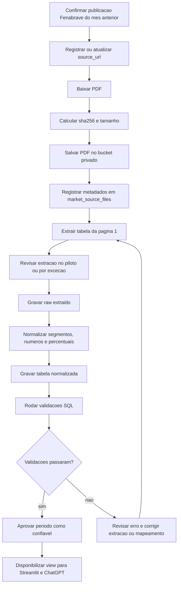

# Fase 1 - Ingestao Fenabrave

Data: 2026-05-15

## Objetivo

Definir a primeira etapa de ingestao da Fenabrave no Supabase, usando emplacamentos como dado principal de venda e market share no Brasil.

Esta fase deve provar que o projeto consegue:

- registrar a fonte de forma auditavel
- preservar o arquivo original quando necessario
- extrair uma tabela do PDF ou fonte original
- manter o dado bruto extraido
- normalizar o dado para analise
- validar os totais contra a publicacao
- entregar uma view simples para Streamlit e ChatGPT

## Status operacional

- 2026-05-15: Entregavel 1 criado no Supabase. A tabela `public.market_data_sources` esta registrada no repositorio em `sql/ddl/tables/010_create_market_data_sources.sql`.
- 2026-05-15: Entregavel 2 criado no Supabase. A tabela `public.market_source_files` esta registrada no repositorio em `sql/ddl/tables/011_create_market_source_files.sql`.

## Escopo da fase 1

Fonte:

- Fenabrave

Arquivo piloto:

- PDF mensal publico da Fenabrave
- exemplo: `https://www.fenabrave.org.br/portal/files/2026_04_02.pdf`

Tabela piloto:

- primeira tabela da pagina 1, com resumo mensal por segmento

Metrica:

- emplacamentos

Uso:

- dashboard interno
- perguntas do ChatGPT via API
- cruzamento futuro com mencoes em titulos de videos e creators automotivos

Frequencia da rotina:

- mensal
- executar somente apos o 5o dia util do mes
- objetivo da execucao mensal: obter e processar os dados do mes anterior

Fora do escopo desta fase:

- ranking por modelo
- ranking por marca detalhado
- SENATRAN/RENAVAM
- fontes contextuais como ANFAVEA, ABVE, MDIC, Inmetro e Banco Central
- automacao completa de todos os PDFs historicos

## Fluxo da fase 1

```text
Fenabrave PDF ou fonte original
  -> market_data_sources
  -> market_source_files
  -> raw_fenabrave_segment_summary
  -> market_vehicle_registrations_segment
  -> validacao SQL
  -> v_market_registration_segment_summary
  -> Streamlit / ChatGPT
```

## Matriz operacional da fase 1

Esta matriz separa:

1. atividades feitas apenas uma vez para iniciar o processo
2. atividades rotineiras da execucao mensal
3. explicacao de cada bloco da rotina

Responsaveis usados nesta fase:

- `Arthur`: decisao de negocio, aprovacao final e revisao de excecoes
- `Codex/ChatGPT`: apoio tecnico, criacao de SQL, revisao de extracao e documentacao
- `Script de ingestao`: processo Python ou job local/cloud que baixa, salva, extrai e carrega dados
- `Supabase`: Postgres, Storage, views, constraints e validacoes SQL

### Atividades feitas apenas uma vez

Estas atividades preparam a estrutura. Depois de concluidas, nao fazem parte da rotina mensal.

| Ordem | Atividade | Tipo | Responsavel principal | Saida esperada |
|---:|---|---|---|---|
| 1 | Cadastrar a fonte Fenabrave em `market_data_sources` | Manual | Codex/ChatGPT | Fonte cadastrada como `emplacamento` e `structured_ingestion = true` |
| 2 | Criar bucket privado `market-source-files` no Supabase Storage | Manual | Arthur | Bucket privado disponivel para PDFs originais |
| 3 | Criar tabelas da fase 1 no Supabase | Manual | Codex/ChatGPT | DDL versionado para fonte, arquivo, raw, tabela normalizada e validacao |
| 4 | Criar view analitica inicial | Manual | Codex/ChatGPT | `v_market_registration_segment_summary` disponivel para Streamlit e ChatGPT |
| 5 | Definir dicionario inicial de segmentos | Manual | Codex/ChatGPT | Mapeamento como `A) Autos -> autos` e `Total -> total` |
| 6 | Definir regra de aprovacao do periodo | Manual | Arthur + Codex/ChatGPT | Criterio claro para marcar o arquivo como `validated` |

### Rotina mensal

Regra de agenda:

- executar mensalmente apos o 5o dia util
- sempre processar o mes anterior
- exemplo: apos o 5o dia util de maio, processar abril



### Blocos da rotina mensal

| Bloco | Atividades incluidas | Tipo predominante | Responsavel principal | Saida esperada |
|---|---|---|---|---|
| Confirmacao da fonte | Confirmar publicacao Fenabrave do mes anterior e registrar `source_url` | Manual no piloto; semiautomatico depois | Arthur + Codex/ChatGPT | URL oficial confirmada antes do download |
| Captura do arquivo | Baixar PDF, calcular `sha256`, calcular tamanho e salvar no bucket privado | Automatico | Script de ingestao + Supabase | PDF preservado em `market-source-files/fenabrave/{ano}/{mes}/` |
| Registro de metadados | Inserir linha em `market_source_files` com URL, periodo, storage, hash, status e metodo | Automatico | Script de ingestao | Arquivo rastreavel no Postgres sem guardar o PDF na tabela |
| Extracao | Extrair a primeira tabela da pagina 1 e revisar quando necessario | Semiautomatico | Script de ingestao + Codex/ChatGPT | Linhas extraidas e conferidas |
| Raw | Gravar dados extraidos em `raw_fenabrave_segment_summary` | Automatico | Script de ingestao | Dados brutos preservados como texto |
| Normalizacao | Converter nomes, numeros e percentuais para formato analitico | Automatico | Script de ingestao | Valores prontos como `integer` e `numeric` |
| Carga analitica | Inserir dados em `market_vehicle_registrations_segment` | Automatico | Script de ingestao | Tabela normalizada preenchida |
| Validacao | Rodar checks de soma, total e campos obrigatorios | Automatico | Supabase | Resultado objetivo de qualidade da carga |
| Tratamento de erro | Corrigir extracao, ajustar mapeamento ou rejeitar arquivo | Manual | Arthur + Codex/ChatGPT | Falha resolvida antes de liberar dados |
| Liberacao | Marcar periodo como confiavel e consumir a view | Manual para aprovacao; automatico para consumo | Arthur + Streamlit/ChatGPT API | Dados disponiveis em `v_market_registration_segment_summary` |

Regra pratica:

- decisoes, revisoes e aprovacoes ficam com humanos
- download, storage, metadados, raw, normalizacao e validacao devem virar automacao
- extracao de PDF comeca semiautomatica porque o layout pode mudar entre meses
- a rotina mensal so deve liberar dados quando as validacoes passarem

## Entregavel 1 - Tabela de controle de fonte

### O que e

Cadastro da fonte em si.

Ela nao representa um PDF especifico. Ela representa a instituicao/fonte usada pelo projeto.

### Para que serve

Responder:

- quem e a fonte?
- que tipo de dado ela fornece?
- ela e fonte estruturada do produto ou apenas contexto?
- qual papel analitico ela tem?
- ela mede venda, frota, producao ou contexto?

### Tabela sugerida

```sql
CREATE TABLE public.market_data_sources (
  id bigserial PRIMARY KEY,
  source_name text NOT NULL,
  source_type text NOT NULL,
  data_role text NOT NULL,
  structured_ingestion boolean NOT NULL DEFAULT false,
  priority integer,
  access_type text NOT NULL,
  official_url text,
  notes text,
  created_at timestamptz NOT NULL DEFAULT now(),
  updated_at timestamptz NOT NULL DEFAULT now(),

  CONSTRAINT market_data_sources_source_name_key UNIQUE (source_name)
);
```

### Exemplo de registro

```sql
INSERT INTO public.market_data_sources (
  source_name,
  source_type,
  data_role,
  structured_ingestion,
  priority,
  access_type,
  official_url,
  notes
)
VALUES (
  'Fenabrave',
  'entidade_setorial',
  'emplacamento',
  true,
  1,
  'publico_pdf',
  'https://www.fenabrave.org.br/portalv2/Conteudo/Emplacamentos%20',
  'Fonte pratica principal para emplacamentos e leitura mensal de mercado.'
);
```

## Entregavel 2 - Tabela de arquivo/fonte capturada

### O que e

Registro de cada arquivo, URL ou publicacao capturada.

A fonte e `Fenabrave`. O arquivo capturado pode ser `Relatorio abril/2026`.

### Para que serve

Responder:

- qual arquivo foi usado?
- de qual URL veio?
- qual periodo ele representa?
- quando foi capturado?
- onde o arquivo original foi preservado?
- a extracao deu certo?
- qual hash garante que o arquivo nao mudou?

### Onde guardar PDFs alem do link

O link publico nao deve ser a unica referencia. PDFs podem sair do ar, mudar de URL ou ser substituidos.

Recomendacao:

1. Guardar o arquivo binario em um bucket privado do Supabase Storage.
2. Guardar no Postgres apenas os metadados e o caminho do objeto.
3. Guardar tambem `source_url`, `sha256`, tamanho do arquivo e data de captura.

Bucket sugerido:

```text
market-source-files
```

Caminho sugerido no bucket:

```text
fenabrave/2026/04/2026_04_02.pdf
```

Exemplo completo:

```text
source_url: https://www.fenabrave.org.br/portal/files/2026_04_02.pdf
storage_bucket: market-source-files
storage_path: fenabrave/2026/04/2026_04_02.pdf
sha256: hash_calculado_do_pdf
file_size_bytes: tamanho_em_bytes
captured_at: 2026-05-15
```

Uso local opcional:

- durante desenvolvimento, o PDF pode ficar temporariamente em `data/raw/fenabrave/2026/04/`
- nao usar pasta local como fonte final de verdade
- nao versionar PDFs grandes no Git sem necessidade
- se houver arquivo pequeno usado como fixture de teste, guardar apenas uma amostra controlada

### Como criar o bucket no Supabase

Para esta fase, criar o bucket manualmente pelo Supabase Dashboard. Isso evita misturar setup de infraestrutura com a rotina mensal de ingestao.

Passo a passo:

1. Acessar o projeto no Supabase.
2. Abrir `Storage`.
3. Clicar em `New bucket` ou `Create bucket`.
4. Informar o nome:

```text
market-source-files
```

5. Manter o bucket como privado.
6. Configurar restricao de tipo de arquivo para PDF, se a interface permitir:

```text
application/pdf
```

7. Configurar limite de tamanho suficiente para relatorios mensais da Fenabrave, por exemplo:

```text
20MB
```

8. Criar o bucket.
9. Nao criar URL publica para os PDFs.
10. Usar o caminho padrao para uploads:

```text
fenabrave/{ano}/{mes}/{nome_original_do_arquivo}
```

Exemplo:

```text
fenabrave/2026/04/2026_04_02.pdf
```

Configuracao esperada:

```text
bucket_id: market-source-files
public: false
allowed_mime_type: application/pdf
file_size_limit: 20MB
```

Observacao importante:

- o bucket privado guarda o arquivo original
- o Postgres guarda apenas metadados, como `storage_bucket`, `storage_path`, `source_url`, `sha256`, `file_size_bytes` e `captured_at`
- o PDF nao deve ser salvo dentro de uma coluna do Postgres

### Como o script deve usar o bucket

O script de ingestao deve rodar em ambiente seguro, como maquina local controlada, job interno ou backend.

Ele pode usar uma chave com permissao administrativa para:

- baixar o PDF da Fenabrave
- enviar o PDF ao Supabase Storage
- inserir metadados em `market_source_files`
- carregar raw e tabelas normalizadas

Regra de seguranca:

- nunca expor `SUPABASE_SERVICE_ROLE_KEY` no Streamlit publico, navegador ou frontend
- o Streamlit e o ChatGPT devem consumir views e metadados ja validados
- se for necessario abrir o PDF original no app, gerar uma signed URL curta a partir de backend seguro

Exemplo conceitual de upload pelo script:

```python
storage_path = "fenabrave/2026/04/2026_04_02.pdf"

supabase.storage.from_("market-source-files").upload(
    storage_path,
    pdf_bytes,
    file_options={"content-type": "application/pdf", "upsert": "false"}
)
```

Depois do upload, gravar no Postgres:

```text
storage_bucket: market-source-files
storage_path: fenabrave/2026/04/2026_04_02.pdf
source_url: https://www.fenabrave.org.br/portal/files/2026_04_02.pdf
sha256: hash_calculado_do_pdf
file_size_bytes: tamanho_em_bytes
captured_at: data_hora_da_captura
```

### Como operacionalizar a extracao agora

Situacao atual da fase:

- bucket `market-source-files` criado
- PDF de abril salvo no Supabase Storage
- tabela `market_data_sources` ja possui DDL no projeto

Antes de extrair dados do PDF, ainda precisam existir no Supabase:

- `market_source_files`
- `raw_fenabrave_segment_summary`
- `market_vehicle_registrations_segment`
- `market_ingestion_validation_results`, opcional mas recomendado
- `v_market_registration_segment_summary`

O processo operacional da extracao deve ser:

```text
1. Registrar o PDF salvo no Storage em market_source_files
2. Baixar o PDF do Storage para uma pasta temporaria
3. Extrair a primeira tabela da pagina 1
4. Gravar a tabela extraida em raw_fenabrave_segment_summary
5. Normalizar os segmentos e numeros
6. Gravar a tabela normalizada em market_vehicle_registrations_segment
7. Rodar validacoes SQL
8. Se as validacoes passarem, marcar market_source_files.extraction_status = validated
9. Consumir a view no Streamlit/ChatGPT
```

O script nao deve procurar o PDF na internet nesta etapa, porque o arquivo ja esta no Storage. Ele deve partir de:

```text
storage_bucket: market-source-files
storage_path: fenabrave/2026/04/2026_04_02.pdf
reference_period: 2026-04-01
source_name: Fenabrave
```

Variaveis de ambiente esperadas pelo script:

```text
SUPABASE_URL
SUPABASE_SERVICE_ROLE_KEY
FENABRAVE_STORAGE_BUCKET=market-source-files
FENABRAVE_STORAGE_PATH=fenabrave/2026/04/2026_04_02.pdf
FENABRAVE_REFERENCE_PERIOD=2026-04-01
FENABRAVE_SOURCE_URL=https://www.fenabrave.org.br/portal/files/2026_04_02.pdf
```

O `SUPABASE_SERVICE_ROLE_KEY` deve ficar apenas no ambiente seguro que roda o script. Ele nao deve ir para Streamlit publico, navegador ou repositorio.

Local recomendado para o script no projeto:

```text
scripts/fenabrave_ingestion/
```

Arquivos esperados:

```text
scripts/fenabrave_ingestion/
  ingest_fenabrave_phase1.py
  requirements.txt
  README.md
```

Bibliotecas provaveis:

```text
supabase
pdfplumber
pandas
python-dotenv
```

Responsabilidade de cada arquivo:

- `ingest_fenabrave_phase1.py`: baixa do Storage, extrai, normaliza, grava e valida
- `requirements.txt`: dependencias do processo
- `README.md`: como configurar `.env` e rodar a extracao

Comando esperado em ambiente local:

```powershell
cd scripts\fenabrave_ingestion
python -m venv .venv
.\.venv\Scripts\Activate.ps1
pip install -r requirements.txt
python ingest_fenabrave_phase1.py
```

No piloto, a extracao deve gerar uma saida de revisao antes de gravar como definitivo. Exemplo:

```text
Segmento                         Abr/2026   Mar/2026   Acum/2026
A) Autos                         187.313    206.361    659.311
B) Com. Leves                    49.943     51.848     175.377
A + B                            237.256    258.209    834.688
```

Se a tabela extraida nao bater visualmente com o PDF:

- nao carregar normalizado
- marcar `extraction_status = failed`
- registrar observacao em `extraction_notes`
- ajustar parser ou fazer extracao manual assistida apenas para o piloto

Se a tabela extraida bater:

- gravar raw
- normalizar
- rodar validacoes
- liberar apenas se os checks passarem

### Tabela sugerida

```sql
CREATE TABLE public.market_source_files (
  id bigserial PRIMARY KEY,
  source_id bigint NOT NULL REFERENCES public.market_data_sources(id),
  reference_period date NOT NULL,
  source_url text NOT NULL,
  source_page_url text,
  file_type text NOT NULL,
  storage_bucket text,
  storage_path text,
  original_filename text,
  file_size_bytes bigint,
  sha256 text,
  captured_at timestamptz NOT NULL DEFAULT now(),
  extraction_status text NOT NULL DEFAULT 'pending',
  extraction_method text,
  extraction_notes text,
  created_at timestamptz NOT NULL DEFAULT now(),

  CONSTRAINT market_source_files_unique_file UNIQUE (source_id, reference_period, source_url)
);
```

### Exemplo de registro

```sql
INSERT INTO public.market_source_files (
  source_id,
  reference_period,
  source_url,
  source_page_url,
  file_type,
  storage_bucket,
  storage_path,
  original_filename,
  file_size_bytes,
  sha256,
  extraction_status,
  extraction_method,
  extraction_notes
)
VALUES (
  1,
  DATE '2026-04-01',
  'https://www.fenabrave.org.br/portal/files/2026_04_02.pdf',
  'https://www.fenabrave.org.br/portalv2/Conteudo/Emplacamentos%20',
  'pdf',
  'market-source-files',
  'fenabrave/2026/04/2026_04_02.pdf',
  '2026_04_02.pdf',
  123456,
  'sha256_a_calcular',
  'extracted',
  'pdf_table_extraction',
  'Primeira tabela da pagina 1 extraida para piloto.'
);
```

## Entregavel 3 - Raw da primeira tabela extraida

### O que e

Versao bruta da tabela extraida do PDF, antes da normalizacao.

Essa tabela deve preservar o que saiu da extracao, inclusive numeros como texto com formato brasileiro.

### Para que serve

Responder:

- o que foi extraido originalmente?
- qual linha veio de qual arquivo?
- qual pagina e tabela do PDF foram usadas?
- se a normalizacao falhar, o dado bruto continua auditavel?

### Tabela sugerida

```sql
CREATE TABLE public.raw_fenabrave_segment_summary (
  id bigserial PRIMARY KEY,
  source_file_id bigint NOT NULL REFERENCES public.market_source_files(id),
  page_number integer NOT NULL,
  table_number integer NOT NULL,
  row_number integer NOT NULL,
  segment_label_raw text,
  apr_2026_raw text,
  mar_2026_raw text,
  accumulated_2026_raw text,
  apr_2025_raw text,
  accumulated_2025_raw text,
  variation_month_raw text,
  variation_year_raw text,
  variation_accumulated_raw text,
  extraction_confidence numeric,
  created_at timestamptz NOT NULL DEFAULT now()
);
```

### Exemplo de registro

```sql
INSERT INTO public.raw_fenabrave_segment_summary (
  source_file_id,
  page_number,
  table_number,
  row_number,
  segment_label_raw,
  apr_2026_raw,
  mar_2026_raw,
  accumulated_2026_raw,
  apr_2025_raw,
  accumulated_2025_raw,
  variation_month_raw,
  variation_year_raw,
  variation_accumulated_raw,
  extraction_confidence
)
VALUES (
  1,
  1,
  1,
  1,
  'A) Autos',
  '187.313',
  '206.361',
  '659.311',
  '152.257',
  '551.901',
  '-9,23',
  '23,02',
  '19,46',
  0.98
);
```

## Entregavel 4 - Tabela normalizada por segmento

### O que e

Versao limpa e pronta para analise.

Aqui:

- `187.313` vira `187313`
- `-9,23` vira `-9.23`
- `A) Autos` vira `segment_code = autos` e `segment_name = Autos`
- cada linha fica ligada ao arquivo de origem

### Para que serve

Responder:

- quantos emplacamentos ocorreram por segmento?
- qual foi a variacao mensal?
- qual foi a variacao ano contra ano?
- qual foi o acumulado do ano?
- qual arquivo sustenta esse numero?

### Tabela sugerida

```sql
CREATE TABLE public.market_vehicle_registrations_segment (
  id bigserial PRIMARY KEY,
  source_file_id bigint NOT NULL REFERENCES public.market_source_files(id),
  reference_period date NOT NULL,
  market_scope text NOT NULL DEFAULT 'Brasil',
  metric_name text NOT NULL DEFAULT 'emplacamentos',
  segment_code text NOT NULL,
  segment_name text NOT NULL,
  current_month_units integer,
  previous_month_units integer,
  current_year_accumulated_units integer,
  previous_year_month_units integer,
  previous_year_accumulated_units integer,
  month_over_month_pct numeric,
  year_over_year_pct numeric,
  accumulated_year_over_year_pct numeric,
  created_at timestamptz NOT NULL DEFAULT now(),

  CONSTRAINT market_vehicle_reg_segment_unique UNIQUE (
    source_file_id,
    reference_period,
    segment_code
  )
);
```

### Exemplo de registro

```sql
INSERT INTO public.market_vehicle_registrations_segment (
  source_file_id,
  reference_period,
  segment_code,
  segment_name,
  current_month_units,
  previous_month_units,
  current_year_accumulated_units,
  previous_year_month_units,
  previous_year_accumulated_units,
  month_over_month_pct,
  year_over_year_pct,
  accumulated_year_over_year_pct
)
VALUES (
  1,
  DATE '2026-04-01',
  'autos',
  'Autos',
  187313,
  206361,
  659311,
  152257,
  551901,
  -9.23,
  23.02,
  19.46
);
```

## Entregavel 5 - Validacao contra o PDF ou fonte original

### O que e

Conjunto de queries que prova que o dado normalizado bate com a publicacao original.

### Para que serve

Evitar que uma tabela extraida errado entre no dashboard como se fosse confiavel.

### Validacoes obrigatorias

1. `Autos + Comerciais Leves = A + B`
2. `Caminhoes + Onibus = C + D`
3. `Subtotal + Motos + Impl. Rod. + Outros = Total`
4. total normalizado deve bater com total publicado
5. percentuais devem bater com os valores publicados dentro de tolerancia definida
6. nenhuma linha principal da tabela deve ficar sem `segment_code`

### Query exemplo - totais principais

```sql
WITH base AS (
  SELECT
    segment_code,
    current_month_units
  FROM public.market_vehicle_registrations_segment
  WHERE source_file_id = 1
    AND reference_period = DATE '2026-04-01'
),
checks AS (
  SELECT
    'autos_plus_comerciais_leves' AS check_name,
    (SELECT current_month_units FROM base WHERE segment_code = 'autos')
      + (SELECT current_month_units FROM base WHERE segment_code = 'comerciais_leves') AS calculated_value,
    (SELECT current_month_units FROM base WHERE segment_code = 'autos_comerciais_leves') AS expected_value

  UNION ALL

  SELECT
    'caminhoes_plus_onibus' AS check_name,
    (SELECT current_month_units FROM base WHERE segment_code = 'caminhoes')
      + (SELECT current_month_units FROM base WHERE segment_code = 'onibus') AS calculated_value,
    (SELECT current_month_units FROM base WHERE segment_code = 'caminhoes_onibus') AS expected_value

  UNION ALL

  SELECT
    'subtotal_plus_outros' AS check_name,
    (SELECT current_month_units FROM base WHERE segment_code = 'subtotal')
      + (SELECT current_month_units FROM base WHERE segment_code = 'motos')
      + (SELECT current_month_units FROM base WHERE segment_code = 'implementos_rodoviarios')
      + (SELECT current_month_units FROM base WHERE segment_code = 'outros') AS calculated_value,
    (SELECT current_month_units FROM base WHERE segment_code = 'total') AS expected_value
)
SELECT
  check_name,
  calculated_value,
  expected_value,
  calculated_value - expected_value AS difference,
  calculated_value = expected_value AS passed
FROM checks;
```

### Query exemplo - total especifico do PDF piloto

Para o PDF de abril/2026, o total da primeira tabela deve ser `479662`.

```sql
SELECT
  segment_code,
  current_month_units,
  current_month_units = 479662 AS passed
FROM public.market_vehicle_registrations_segment
WHERE source_file_id = 1
  AND reference_period = DATE '2026-04-01'
  AND segment_code = 'total';
```

### Tabela opcional de resultados de validacao

```sql
CREATE TABLE public.market_ingestion_validation_results (
  id bigserial PRIMARY KEY,
  source_file_id bigint NOT NULL REFERENCES public.market_source_files(id),
  check_name text NOT NULL,
  calculated_value numeric,
  expected_value numeric,
  difference numeric,
  passed boolean NOT NULL,
  severity text NOT NULL DEFAULT 'error',
  notes text,
  checked_at timestamptz NOT NULL DEFAULT now()
);
```

## Entregavel 6 - View analitica inicial

### O que e

Camada simples para consumo pelo Streamlit e ChatGPT.

O app nao deve consultar raw nem repetir regra de limpeza. Ele deve consumir uma view ja normalizada.

### Para que serve

Responder perguntas simples como:

- qual segmento cresceu mais contra o ano anterior?
- qual segmento caiu contra o mes anterior?
- qual foi o total de emplacamentos no periodo?
- qual periodo e fonte sustentam o dado?

### View sugerida

```sql
CREATE OR REPLACE VIEW public.v_market_registration_segment_summary AS
SELECT
  r.reference_period,
  r.market_scope,
  r.metric_name,
  r.segment_code,
  r.segment_name,
  r.current_month_units,
  r.previous_month_units,
  r.current_year_accumulated_units,
  r.previous_year_month_units,
  r.previous_year_accumulated_units,
  r.month_over_month_pct,
  r.year_over_year_pct,
  r.accumulated_year_over_year_pct,
  s.source_name,
  f.source_url,
  f.storage_bucket,
  f.storage_path,
  f.captured_at,
  f.extraction_status
FROM public.market_vehicle_registrations_segment r
JOIN public.market_source_files f ON f.id = r.source_file_id
JOIN public.market_data_sources s ON s.id = f.source_id;
```

### Query de consumo exemplo

```sql
SELECT
  reference_period,
  segment_name,
  current_month_units,
  month_over_month_pct,
  year_over_year_pct,
  source_name,
  captured_at
FROM public.v_market_registration_segment_summary
WHERE reference_period = DATE '2026-04-01'
ORDER BY current_month_units DESC;
```

## Politica para guardar PDFs

### Regra principal

Todo PDF usado como fonte estruturada deve ter:

- link original
- copia preservada em storage
- hash do arquivo
- data de captura
- tamanho do arquivo
- status de extracao
- metodo de extracao

### Onde guardar

Recomendacao para producao:

```text
Supabase Storage bucket: market-source-files
```

Padrao de caminho:

```text
fenabrave/{ano}/{mes}/{nome_original_do_arquivo}
```

Exemplo:

```text
fenabrave/2026/04/2026_04_02.pdf
```

### Onde nao guardar como fonte final

Evitar usar como fonte final:

- link publico isolado
- pasta local do computador
- arquivo solto no repositorio Git
- anexo sem hash ou metadados

### Quando guardar no Git

Guardar PDF no Git apenas se:

- for uma amostra pequena para teste
- houver necessidade real de fixture
- o arquivo nao causar peso no repositorio

Mesmo nesse caso, o dado de producao deve apontar para o storage e para a URL original.

## Estados de extracao

Estados sugeridos para `market_source_files.extraction_status`:

```text
pending
downloaded
stored
extracted
normalized
validated
failed
```

Uso esperado:

- `pending`: arquivo identificado, ainda nao baixado
- `downloaded`: arquivo baixado temporariamente
- `stored`: copia preservada no storage
- `extracted`: tabela raw gerada
- `normalized`: tabela analitica preenchida
- `validated`: checks principais passaram
- `failed`: houve erro em alguma etapa

## Criterio de pronto da fase 1

A Fase 1 estara pronta quando:

- Fenabrave estiver cadastrada em `market_data_sources`
- o PDF piloto estiver registrado em `market_source_files`
- o PDF piloto tiver caminho de storage definido
- a primeira tabela da pagina 1 existir em raw
- a tabela normalizada por segmento estiver preenchida
- os checks de totais passarem
- a view inicial retornar dados com fonte, periodo e captura
- o ChatGPT puder responder usando a view sem buscar o PDF ao vivo

## Commit sugerido

```text
docs(analytics): detalha fase fenabrave de ingestao
```
